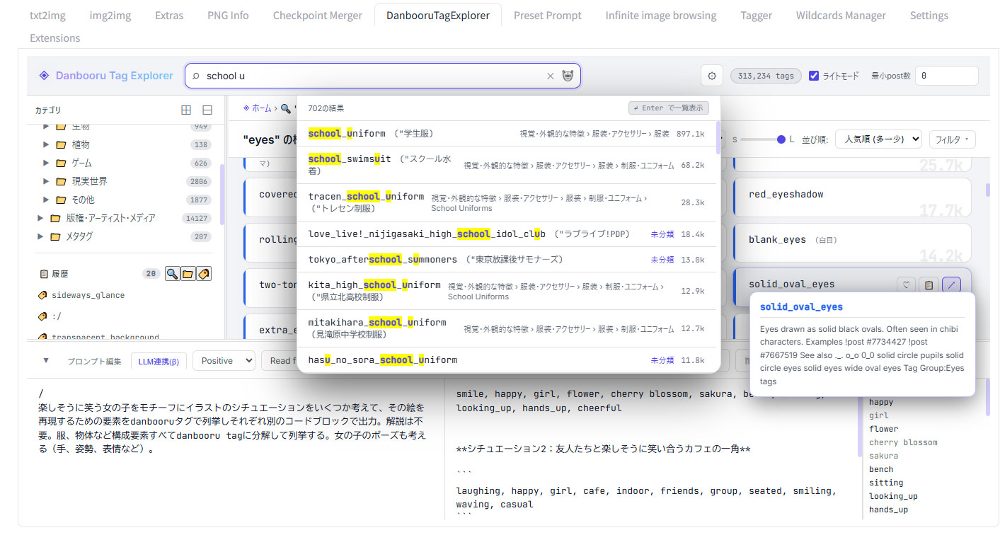

# Danbooru Tag Explorer

Danbooru のタグをカテゴリツリーから探すためのローカルビューアです。

- カテゴリツリーでタグを階層的に探索
- 各タグのdanbooru wikiプレビュー表示とリンク機能
- タグ名・日本語名での全文インクリメンタル検索
- 複数タグのand検索
- お気に入り・ピン止め（複数端末で共有可）
- 検索・カテゴリ・スクラッチパッドの履歴（ブラウザごとに保持）
- スクラッチパッドへのタグ蓄積とコピー
- グリッドビュー: カードサイズ S / M / L の切り替え（文字サイズ・折り返し・日本語表示が自動調整）
- モバイル・スマートフォン対応
- A1111系Stable Diffusion WEBUIの拡張として動作可能



## 必要なもの

- **Python 3.9 以上**
- **uv**（推奨）または pip で `flask` をインストール済みの環境

uv を使うと Flask の依存関係を自動で管理します。未導入の場合は次のコマンドでインストールできます。

**Windows (PowerShell):**
```powershell
winget install astral-sh.uv
# または
powershell -c "irm https://astral.sh/uv/install.ps1 | iex"
```

**macOS / Linux:**
```bash
curl -LsSf https://astral.sh/uv/install.sh | sh
```

uv がない場合は、起動スクリプトが自動で `pip install flask` にフォールバックします。

## 起動方法

### Windows

```bat
run.bat
```

### macOS / Linux

初回のみ実行権限を付与してください。

```bash
chmod +x run.sh
./run.sh
```

起動後、ブラウザが自動で開きます。スマートフォンなど同一 LAN の別端末からは、
起動時にターミナルに表示されるローカル IP アドレスの URL でアクセスできます。

```
  This PC:    http://localhost:8000/
  Other devices: http://192.168.x.x:8000/
```

サーバーを停止するには Ctrl+C を押すか、起動したウィンドウを閉じてください。

## Stable Diffusion WebUI (A1111 / reForge) 拡張としてインストールする

### インストール手順

WebUI の **Extensions** タブ → **Install from URL** に次の URL を入力してインストールします。

```
https://github.com/<your-repo>/danbooru_tag_explorer
```

または `extensions/` フォルダに本リポジトリをフォルダごと配置してください。

```
stable-diffusion-webui/
└── extensions/
    └── danbooru_tag_explorer/   ← このフォルダを置く
        ├── scripts/
        │   └── danbooru_tag_explorer.py
        ├── index.html
        ├── app.js
        └── ...
```

WebUI を再起動すると **DanbooruTagExplorer** タブが追加されます。

> **キャッシュについて**: 拡張の JS / CSS はブラウザにキャッシュされます。ファイルを更新した後は WebUI を再起動してください。起動時にファイルの更新日時をもとにキャッシュバスティング用クエリパラメータ (`?v=<mtime>`) が自動付加されるため、再起動後のブラウザ通常リロードで最新版が読み込まれます。

### danbooru.csv の準備

拡張モードでは起動スクリプト（`run.bat`）が実行されないため、`danbooru.csv` は次のいずれかの方法で用意してください。

1. **[a1111-sd-webui-tagcomplete](https://github.com/DominikDoom/a1111-sd-webui-tagcomplete) を導入済みの場合**、そのCSVを自動で借用します。追加作業は不要です。
2. **スタンドアロンモードで一度起動する**（`run.bat` / `run.sh`）と `data/danbooru.csv` が自動取得されます。その後 WebUI を再起動してください。
3. **手動配置**: 互換CSVを `data/danbooru.csv` としてコピーしてください。

### タグ・翻訳ファイルのパスを変更する

WebUI の **Settings** → **Danbooru Tag Explorer** セクションで設定できます。

| 項目 | 説明 |
|------|------|
| タグCSVファイルパス | 空欄 = 自動検出（上記の順序）。絶対パスまたは相対パス（拡張フォルダ `danbooru_tag_explorer/` 基準）で指定。 |
| 日本語訳CSVファイルパス | 空欄 = `data/ja.csv`。絶対パスまたは相対パス（拡張フォルダ基準）で指定。 |

設定変更後は **DanbooruTagExplorer** タブをリロード（ブラウザの更新ボタン）してください。WebUI の再起動は不要です。

## ファイル構成

```
danbooru_tag_explorer/
├── index.html          # アプリ本体 (HTML)
├── app.js              # アプリ本体 (JavaScript)
├── dte_app.css         # スタイルシート
├── server.py           # Flask サーバー (静的配信 + API)
├── run.bat             # Windows 用起動スクリプト
├── run.sh              # macOS / Linux 用起動スクリプト（未検証）
├── generate_ja.py      # data/ja.csv サンプル生成スクリプト
├── tools/
│   └── build_tag_tree.py   # tag_tree.json 再生成スクリプト(生成物は同梱済み。通常は実行不要です)
└── data/
    ├── tag_tree.json       # カテゴリツリーデータ (同梱)
    ├── danbooru.csv        # タグメタデータ (初回起動時にa1111-sd-webui-tagcompleteのリポジトリより自動取得)
    ├── ja.csv              # 日本語翻訳データ (generate_ja.py で生成)
    └── settings.json       # お気に入り・ピン止め (サーバー側保存、自動生成)
```

danbooru.csv / ja.csv は互換性のある他のデータと差し替え可能です。
データを直接差し替えるか、`settings.json` の `"tagCsv"` `"jaCsv"` のファイルパスを書き換えてください（スタンドアロンモードのみ有効。A1111拡張モードでは Settings タブから設定してください）。`"_notes"` 以下はデフォルトパスを記載したコメントですので編集不要です。
以下のデータが流用できる事を確認しています。日本語でのタグ検索性を向上させたい場合は特に導入を推奨します。

- [CIVITAI:tagcomplete用辞書&日本語翻訳辞書 / asugonomi](https://civitai.com/models/2018479/danbooru-tag-complete-csv-tagcompleteand?modelVersionId=2284461)

## データの永続化

| データ             | 保存先                   | 端末間共有 |
|--------------------|--------------------------|-----------|
| お気に入りタグ     | `data/settings.json`     | 共有される |
| ピン止めカテゴリ   | `data/settings.json`     | 共有される |
| 検索履歴           | ブラウザの localStorage  | 端末ごと  |
| カテゴリ閲覧履歴   | ブラウザの localStorage  | 端末ごと  |
| スクラッチパッド   | ブラウザの localStorage  | 端末ごと  |

お気に入りとピン止めはサーバー側の `data/settings.json` に保存されるため、
同一サーバーにアクセスする複数端末間で自動的に共有されます。

## 同梱データについて

`data/tag_tree.json` は Danbooru Wiki のタググループページから生成したカテゴリツリーデータです。
タグ名・Wiki ページ URL・カテゴリ階層を含みます。
画像・サムネイル・Wiki 本文全文・投稿データは含みません。
機械的な生成物であり不適当なカテゴリ分けを含む場合があります。

主な参照元:

- Danbooru: https://danbooru.donmai.us/
- tagcomplete 用 CSV: https://github.com/DominikDoom/a1111-sd-webui-tagcomplete
- タグツリー seed: https://github.com/KohakuBlueleaf/danbooru-tag-tree

## tag_tree.json の再生成

通常は再生成不要です。Danbooru 側の分類構造が大きく変わった場合にのみ実行してください。

```bash
python tools/build_tag_tree.py --out data/tag_tree.fixed.json --report data/tag_tree_report.json
```

問題なければ `data/tag_tree.fixed.json` を `data/tag_tree.json` に差し替えます。

生成スクリプトは Danbooru Wiki / API にアクセスします。
サーバー負荷を避けるため、繰り返し実行や定期実行はしないでください。
リクエスト間には既定で 1 秒の待機が入っています。

## 更新履歴

[CHANGELOG.md](CHANGELOG.md) を参照してください。

## 開発について

本プロジェクトには各種生成AIによる成果物が含まれています。

## License

Code in this repository is licensed under MIT.

Generated tag tree data is derived from public Danbooru wiki/tag metadata and the
historical seed structure from KohakuBlueleaf/danbooru-tag-tree.
No ownership of Danbooru-originated metadata is claimed.
Please follow Danbooru's terms and the upstream sources' terms when using the generated data.
